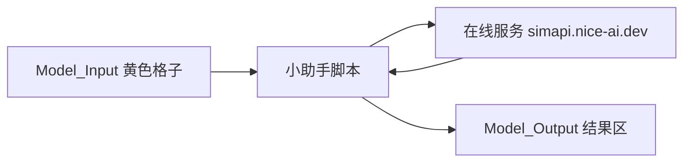

# Excel 工作簿调用在线计算服务 — 零基础分步教程

本教程面向**从未接触过 JavaScript（JS）和 Web API** 的用户。  
你只要在 Excel 里**填表、点几下、复制粘贴一段脚本**，就能让表格把数据发给服务器，并把结果写回表格。

---

## 一、先搞清楚「你在做什么」

可以把它想成：

1. **Excel 工作簿** = 一张带表格的「申请表」（进料、温度、组分等）。
2. **在线计算服务（API）** = 机房里的计算程序，地址是：  
   **`https://simapi.nice-ai.dev`**
3. **小助手脚本（`WebServiceDemo.js`）** = 在 Excel 里帮你自动完成：  
   **读表 → 上网提交 → 把结果写回表**

你**不需要会编程**；只需要会打开 Excel、复制粘贴、在控制台里输入两行「运行命令」（下面会一步步写）。



> **说明**：当前联调做的是「进料与组分快速核算」类 KPI，**不是**在 Excel 里跑完整 Gibbs 全流程；完整仿真仍在 Python/Streamlit 主程序里。

---

## 二、开始前请准备

| 序号 | 准备项 | 说明 |
|------|--------|------|
| 1 | 电脑已安装 **Microsoft Excel**（Mac 或 Windows） | 本教程以 Mac 版为例；Windows 步骤类似 |
| 2 | 能打开终端（Mac：**终端.app**） | 仅用于**生成工作簿**和**查看 API Key**，每天用一次即可 |
| 3 | 项目文件夹 `ss-biomass-pfd` | 同事或仓库里已有 |
| 4 | **API Key（访问密钥）** | 像密码，向管理员索取，或按下面「步骤 2」自己查 |
| 5 | 能上网 | 要访问 `https://simapi.nice-ai.dev` |

**可选**：若你用 **WPS 表格** 而不是 Microsoft Excel，请直接跳到本文 **「十二、WPS 用户」**。

---

## 三、名词白话解释（看不懂就查这里）

| 名词 | 白话 |
|------|------|
| **API** | 网上提供的「计算接口」，表格用 HTTPS 把数据发过去，它返回 JSON 结果 |
| **WebService** | 通过网址（HTTP/HTTPS）调用的服务，这里指上面的 API |
| **HTTPS** | 加密的网址，必须以 `https://` 开头 |
| **JS / JavaScript** | 一种脚本语言；本教程里只需**粘贴现成文件**，不用自己写 |
| **命名区域** | Excel 里给一块单元格起的「固定名字」，脚本按名字找数据，例如 `Input_Feed_Table` |
| **API Key** | 访问密钥，填在 `Input_API_Key`，防止陌生人乱用你的计算服务 |
| **Script Lab** | Excel 免费加载项，用来运行本教程的 JS 脚本 |
| **控制台** | Script Lab 里显示日志、输入命令的黑底/白底文字窗口 |

---

## 四、步骤 1：生成 Excel 工作簿

1. 打开 **终端**。
2. 复制粘贴下面整段（一次一行执行也可以）：

```bash
cd /你的路径/ss-biomass-pfd
python3 -m pip install -r requirements.txt
python3 scripts/build_simulator_workbook.py --case Case-1
```

3. 看到类似提示即成功：

```text
已写入 .../export/Biomass_PFD_Simulator.xlsx
```

4. 用 **Excel** 双击打开：

```text
ss-biomass-pfd/export/Biomass_PFD_Simulator.xlsx
```

5. 工作簿里有 5 张表，**第一次使用请打开紫色的「WebService」页**：

| 工作表 | 作用 |
|--------|------|
| **Guide** | 总导航（可点击跳转到 WebService） |
| **WebService** | **内置联调教程 + API Key 黄色输入格**（主入口） |
| **Model_Input** | 进料与化学参数（黄格可改） |
| **Model_Output** | 联调 KPI / 仿真结果 |
| **PFD** | 流程图 |

---

## 五、步骤 2：获取 API Key（访问密钥）

API Key 相当于「只有你知道的密码」。**不要发给外人，不要截图发群。**

### 方式 A：管理员发给你

直接要一串 **64 位左右十六进制字符**即可。

### 方式 B：你有 VPS 权限时在终端查

```bash
ssh nice-ai-LZ 'grep SIM_API_KEY /etc/default/ss-biomass-api'
```

输出类似：

```text
SIM_API_KEY=一长串字母和数字
```

**只复制等号后面**那一长串。

---

## 六、步骤 3：把 API Key 填进工作簿

1. 在 Excel 打开 `Biomass_PFD_Simulator.xlsx`。
2. 点底部紫色的 **「WebService」** 工作表（工作簿里已写好分步说明，可跟着做）。
3. 找到标题 **「① 必填：在此填写 API Key」** 下方的**黄色格子**（「填写区」列）。
4. 粘贴你的 API Key（不要有多余空格）。
5. 保存工作簿（`Cmd + S`）。

> 该格已命名为 **`Input_API_Key`**，脚本会自动读取，无需再手动设置名称管理器。

---

## 七、步骤 4：安装 Script Lab（仅 Microsoft Excel）

Script Lab 是微软提供的免费加载项，用来运行我们的脚本。

### Mac Excel

1. 菜单 **插入 → 加载项**（或 **Insert → Add-ins**）。
2. 搜索 **「Script Lab」**。
3. 点击 **添加/安装**。
4. 安装后，功能区会出现 **Script Lab** 选项卡。

若搜不到：打开浏览器访问 [https://appsource.microsoft.com](https://appsource.microsoft.com) 搜索 Script Lab，或让 IT 允许 Office 加载项。

### Windows Excel

步骤相同：**插入 → 获取加载项 → 搜索 Script Lab → 添加**。

---

## 八、步骤 5：把小助手脚本放进 Script Lab

1. 用**记事本**或 **VS Code** 打开项目里的文件（不要用 Word）：

```text
ss-biomass-pfd/export/js/WebServiceDemo.js
```

2. **全选**（`Cmd+A`）并 **复制**（`Cmd+C`）整个文件内容。
3. 回到 Excel，打开 **Script Lab** 选项卡。
4. 点 **Code**（代码）页。
5. **删掉**编辑器里原有示例代码，**粘贴**你刚复制的内容。
6. 不必点保存到云端；本机 Script Lab 会保留当前代码。

---

## 九、步骤 6：先测「能不能连上服务器」

1. 在 Script Lab 里切换到 **Console**（控制台）页。
2. 在底部输入框输入下面这一行（可整行复制）：

```javascript
await runWebServiceHealthCheck();
```

3. 按 **Enter** 运行。
4. **成功时**控制台会出现类似：

```text
[WebServiceDemo] ... GET health
[WebServiceDemo] ... health response { status: 200, body: "{\"status\":\"ok\"..." }
```

若 `status: 200` 且 body 里有 `"ok"`，说明网络和网址都正常。

### 若失败

| 控制台/报错 | 处理 |
|-------------|------|
| `Load failed` | 检查是否联网；网址必须是 `https://simapi.nice-ai.dev`（脚本已默认） |
| 找不到 `runWebServiceHealthCheck` | 脚本没贴全，回到步骤 5 重新粘贴 |
| 公司网络拦截 | 换手机热点试一次，或联系 IT 放行该域名 |

---

## 十、步骤 7：正式计算并写回表格

1. 确认 **WebService** 页 API Key 黄格已填写。
2. 确认 **进料流股**、**化学与平衡调参** 等黄格数据是你想要的（默认已是 Case-1 模板）。
3. 在 Script Lab **Console** 输入：

```javascript
await runWebServiceLiteDemo();
```

4. 按 **Enter**，等待几秒到十几秒。
5. **成功时**：
   - 控制台依次出现 `START` → `Payload built` → `Response received` → `DONE`
   - 可能弹出或状态栏提示：`WebService 联调成功，status=ok`
6. 打开 **Model_Output** 工作表，找到 **「关键物流与对标误差」** 区域（命名区域 **`Output_KPI_Table`**），应看到例如：

| metric | value | unit |
|--------|-------|------|
| TOTAL_FEED_KG_H | 约 8000+ | kg/h |
| INCI_FEED_KG_H | … | kg/h |
| O2IN_SUM_MOL_PCT | 100 | % |

> 若你生成工作簿时用了 `--no-run`，可能没有 `Output_KPI_Table`；请用步骤 1 的命令**不要加** `--no-run` 重新生成，或先运行一次 Streamlit/本地仿真再导出。

---

## 十一、步骤 8：改数据再算一次（验证真的在用你的表）

1. 到 **Model_Input → 进料流股**，把某一行的 **MassFlow_kg_h** 改大一点（黄格）。
2. 保存。
3. 在 Script Lab 控制台**再运行一次**：

```javascript
await runWebServiceLiteDemo();
```

4. 看 **Model_Output** 里 **TOTAL_FEED_KG_H** 是否跟着变化。  
   若变化了，说明 Excel 确实在把你的输入发给 API。

---

## 十二、WPS 用户（不用 Script Lab）

1. 打开同一工作簿 `Biomass_PFD_Simulator.xlsx`。
2. **开发工具 → JS 宏**（若没有，在选项里启用「开发工具」）。
3. 新建宏，**粘贴** `export/js/WebServiceDemo.js` 全文。
4. 打开 **宏编辑器里的控制台**，依次运行：

```javascript
await runWebServiceHealthCheck();
await runWebServiceLiteDemo();
```

5. 结果同样在 **Model_Output** 的 KPI 区域查看。

WPS 与 Excel 的菜单名可能略有不同，以你本机为准。

---

## 十三、表格与脚本的对应关系（给愿意多看一眼的人）

脚本会自动读取这些**命名区域**（名称管理器里可见）：

| 命名区域 | 在工作簿哪里 | 内容 |
|----------|--------------|------|
| `Input_CaseID` | Model_Input · 工况标识 | 如 `Case-1` |
| `Input_Feed_Table` | Model_Input · 进料流股表 | 流股名、kg/h、温度、压力 |
| `Input_Chem_Table` | Model_Input · 化学与平衡调参 | O2IN 各组分 mol% 等 |
| `Input_API_Key` | **WebService** 页 · 黄色「填写区」 | 你的密钥 |
| `Output_KPI_Table` | Model_Output · 关键物流与对标误差 | 脚本写入结果 |

发送的数据会 POST 到：

```text
https://simapi.nice-ai.dev/v1/compute/simulate-lite
```

请求头里带上：`X-API-Key: （你在 Z2 填的密钥）`

---

## 十四、常见问题

### 1. 提示「缺少 API Key」

- **WebService 页 API Key 黄格为空** → 粘贴密钥并保存。  
- 或在控制台先执行（把 `你的密钥` 换成真密钥）：

```javascript
window.DEMO_API_KEY = "你的密钥";
await runWebServiceLiteDemo();
```

### 2. 提示 `HTTP 401` 或 unauthorized

密钥错误或与服务器不一致。重新从管理员或 VPS 获取，更新 Z2。

### 3. 提示 `HTTP 403` / Cloudflare

少见；换网络或联系管理员检查域名 `simapi.nice-ai.dev`。

### 4. 找不到命名区域 `Input_Feed_Table`

工作簿不是用 `build_simulator_workbook.py` 生成的旧版文件。按 **步骤 1** 重新生成。

### 5. `Output_KPI_Table` 没变化

- 脚本是否跑到 `DONE`？  
- 是否在 **Model_Output** 正确区域查看？  
- 重新生成工作簿（步骤 1，不要 `--no-run`）。

### 6. 想用本机 Python 服务而不是网上服务

先在终端启动本地服务：

```bash
python3 scripts/run_excel_webservice_demo.py --host 127.0.0.1 --port 8765
```

再在 Script Lab 控制台执行：

```javascript
window.DEMO_BASE_URL = "http://127.0.0.1:8765";
window.DEMO_API_KEY = "";
await runWebServiceLiteDemo();
```

---

## 十五、没有 Script Lab 时的替代（终端一键，不打开 Excel 宏）

适合 CI、Agent 或暂时装不了加载项时；**逻辑与 Excel 里相同**：

```bash
cd ss-biomass-pfd
python3 scripts/excel_ws_cli.py --health-only
python3 scripts/excel_ws_cli.py --write-back
```

会在不启动 Excel 的情况下读 xlsx、调 API、写回 `Output_KPI_Table`。  
详见 `doc/excel_js_local_test.md`。

---

## 十六、相关文件速查

| 文件 | 作用 |
|------|------|
| `export/Biomass_PFD_Simulator.xlsx` | 你的工作簿 |
| `export/js/WebServiceDemo.js` | 粘贴到 Script Lab 的脚本 |
| `doc/excel_api_contract.md` | 技术契约（给开发看） |
| `doc/VPS_DEPLOYMENT.md` | 服务器部署（给运维看） |

---

## 十七、最短操作清单（给熟手）

1. `python3 scripts/build_simulator_workbook.py --case Case-1`  
2. 打开 xlsx → **WebService** 页填 API Key（黄格）  
3. Script Lab 粘贴 `WebServiceDemo.js`  
4. 控制台：`await runWebServiceHealthCheck();`  
5. 控制台：`await runWebServiceLiteDemo();`  
6. 看 **Model_Output** KPI 表  

完成以上步骤，即表示 **Excel 工作簿已完整走通 API 联调**。
