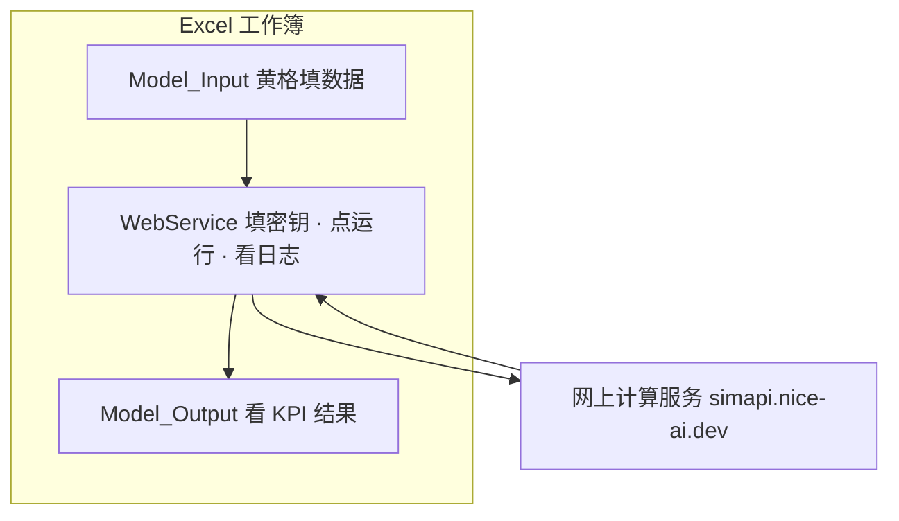

# Excel 在线计算 — 用户操作手册（零基础版）

> **适用对象**：不会 JavaScript、不了解 API，但需要在 Excel 里完成进料核算并查看结果的用户。  
> **你只需会**：打开 Excel、在黄色格子里改数字、复制粘贴、在 Script Lab 里按 Enter。  
> **技术细节**：见 [`excel_workbook_api_上手教程.md`](excel_workbook_api_上手教程.md)；本手册只讲「怎么点、怎么看」。

---

## 1. 用一句话说明白

你把 **Model_Input** 里的进料和参数填好，点一下「运行」，Excel 会把数据发给网上的计算服务，再把算出的 **KPI 数字**写回 **Model_Output**。  
中间过程不用手算，也不用懂代码——**看 WebService 页的颜色和日志**就能知道成功还是哪里出了问题。



**当前联调算什么？**  
快速进料与组分相关的 **KPI 汇总**（如总进料量、各单元进料分配、O2IN 组分合计等）。  
**不算什么？** 完整两台炉 Gibbs 全流程——那在 Python / Streamlit 主程序里。

---

## 2. 工作簿里五张表是干什么的

打开 `export/Biomass_PFD_Simulator.xlsx` 后，底部标签从左到右建议按这个顺序用：

| 顺序 | 工作表 | 你要做什么 |
|------|--------|------------|
| 0 | **Guide** | 总导航，第一次可浏览，日常可跳过 |
| 1 | **Model_Input** | **改黄色格子**里的工况、进料、化学参数 |
| 2 | **WebService** | **填 API 密钥、看健康灯、看运行日志、复制运行命令**（主控制台） |
| 3 | **Model_Output** | **只看结果**（KPI 表，联调成功后自动更新） |
| 4 | **PFD** | 流程图，一般只读 |

记住两条线：**输入在 Model_Input，输出在 Model_Output，操作台在 WebService**。

---

## 3. 第一次使用（约 30 分钟，只做一次）

### 3.1 生成工作簿

请同事或管理员帮你在项目目录执行（或自己打开「终端」复制粘贴）：

```bash
cd /你的路径/ss-biomass-pfd
python3 -m pip install -r requirements.txt
python3 scripts/build_simulator_workbook.py --case Case-1
```

成功后用 **Excel 双击打开**：`export/Biomass_PFD_Simulator.xlsx`。

### 3.2 获取 API 访问密钥

密钥像**密码**，只给你本人用，不要发群、不要截图外传。

- **方式 A**：向管理员索取一串约 64 位的字母数字。  
- **方式 B**（有服务器权限）：终端执行  
  `ssh nice-ai-LZ 'grep SIM_API_KEY /etc/default/ss-biomass-api'`  
  复制等号 `=` **后面**整串。

### 3.3 安装 Script Lab（Microsoft Excel）

Script Lab 是微软免费加载项，用来运行我们提供的一小段脚本（你只需粘贴，不用写代码）。

1. Excel 菜单 **插入 → 加载项**（Insert → Add-ins）  
2. 搜索 **Script Lab** → **添加**  
3. 功能区出现 **Script Lab** 选项卡即成功  

搜不到时：让 IT 允许 Office 加载项，或从 [Microsoft AppSource](https://appsource.microsoft.com) 搜索安装。

### 3.4 粘贴脚本（只做一次）

1. 用**记事本**或 VS Code 打开（不要用 Word）：  
   `ss-biomass-pfd/export/js/WebServiceDemo.js`  
2. **全选**（Ctrl/Cmd + A）→ **复制**  
3. Excel → **Script Lab** → **Code** 页  
4. 删掉编辑器里原有示例，**粘贴**整份文件  

以后除非项目升级脚本，否则**不用重复粘贴**。

### 3.5 把密钥写进工作簿

1. 打开 **WebService** 工作表（紫色标签）  
2. 找到 **「连接与授权」** 区域，**「API 访问密钥」** 那一行的黄色格子  
3. 粘贴密钥 → **保存**（Ctrl/Cmd + S）  

---

## 4. 每次计算的标准流程（约 5 分钟）

下面是你**日常重复**的步骤。建议第一次严格按顺序做一遍。

### 步骤 A — 改输入（Model_Input）

1. 打开 **Model_Input**  
2. 只改**黄色背景**的格子，例如：  
   - **工况标识**：Case ID（一般保持 `Case-1`）  
   - **进料流股**：各流股的 **MassFlow_kg_h**（kg/h）、温度、压力  
   - **化学与平衡调参**：O2IN 各组分 mol% 等  
3. **保存**工作簿  

> 白色/灰色区域是只读或公式，不要改。

### 步骤 B — 打开联调台（WebService）

切到 **WebService** 页，你会看到几块区域：

| 区域 | 作用 |
|------|------|
| **API 健康监控** | 三行状态灯：**绿=正常，黄=偏慢或密钥问题，红=网络/服务异常** |
| **连接与授权** | 确认 API 密钥仍在黄格（换电脑或新工作簿时要重填） |
| **运行命令** | 四条命令，复制到 Script Lab 运行（见步骤 C） |
| **运行日志** | **最重要**：每步自动写在这里，**不用打开 JS 控制台也能排查** |
| **故障诊断** | 常见现象与处理对照 |

### 步骤 C — 在 Script Lab 里运行（复制粘贴即可）

1. 点击 **Script Lab** → **Console**（控制台）  
2. 在底部输入框**一行一行**运行（复制后按 Enter）：

**第一次或换工作簿后，建议四条都跑：**

```javascript
await validateWorkbookTemplate();
```

→ 检查表格结构是否完整。失败时日志会出现 **TEMPLATE**、**修复**，按提示重新生成工作簿。

```javascript
await refreshApiHealthMonitor();
```

→ 刷新健康灯，**不需要密钥**。看 **API 健康监控** 是否变绿。

```javascript
await runWebServiceHealthCheck();
```

→ 测网络和服务是否通，结果写入 **运行日志**。

```javascript
await runWebServiceLiteDemo();
```

→ **正式计算**：读 Model_Input → 上网计算 → 写回 Model_Output。

3. 每运行一条，回到 **WebService** 看 **运行日志** 是否更新（不必一直盯着 Console）。

**熟练后可以简化为：** ② 刷新健康灯 → ④ 正式计算（若 ① 已通过且网络正常）。

### 步骤 D — 看结果（Model_Output）

1. 打开 **Model_Output**  
2. 找到 **「关键物流与对标误差」** 表格  
3. 确认有以下类型的行（数值随你的进料而变）：

| 指标（metric） | 含义（白话） |
|----------------|--------------|
| **TOTAL_FEED_KG_H** | 总进料质量流量（kg/h） |
| **INCI_FEED_KG_H** | 进入 INCI 单元的进料 |
| **RGPOX_FEED_KG_H** | 进入 RGPOX 单元的进料 |
| **SLAG_FEED_KG_H** | 渣相关进料 |
| **O2IN_SUM_MOL_PCT** | O2IN 组分 mol% 是否加和为 100 |
| **NEGATIVE_FEED_COUNT** | 应为 **0**（没有负的进料） |

4. **验证「真的用了你的数据」**：  
   - 回到 Model_Input 把某流股 kg/h **改大** → 保存  
   - 再运行一次 `await runWebServiceLiteDemo();`  
   - 看 **TOTAL_FEED_KG_H** 是否变大  

---

## 5. 不用懂 JS，怎么判断成功或失败

### 5.1 看 WebService「API 健康监控」

| 灯色 | 含义 | 你该做什么 |
|------|------|------------|
| **绿 · 正常** | 网络和服务 OK | 可以运行 ④ 正式计算 |
| **黄 · 偏慢** | 能连上但慢，或密钥问题 | 检查密钥；多等几秒再试 |
| **红 · 异常** | 连不上或服务器错误 | 查网络、VPN；联系管理员 |
| **灰 · 待检查** | 还没运行过检查命令 | 运行 ② 或 ③ |

### 5.2 看「运行日志」最后几行

| 日志步骤 | 含义 |
|----------|------|
| **TEMPLATE · 模板检查通过** | 工作簿结构 OK |
| **TEMPLATE / 缺少 / 修复** | 工作簿太旧或损坏 → 按日志里的命令重建 xlsx |
| **GET /health · 200** | 服务器连通 |
| **API Key · 已读取** | 密钥读到了 |
| **POST · simulate-lite** | 正在提交计算 |
| **HTTP · 200** | 服务器接受请求 |
| **已写回 · Output_KPI_Table** | 结果已写入 Model_Output |
| **DONE** | **整次联调成功** |
| **ERROR** | 失败，同一行「说明」列有原因 |

> **习惯**：出问题先看 **WebService 运行日志**，再看健康灯；只有需要给管理员排查时才打开 Script Lab Console。

### 5.3 Model_Output 快速核对

- **NEGATIVE_FEED_COUNT = 0** → 进料没有填成负数  
- **O2IN_SUM_MOL_PCT ≈ 100** → 氧气流组分比例合理  
- **TOTAL_FEED_KG_H** 与你在进料表里加总的量级一致（不必手算精确，明显差一个数量级就不对）

---

## 6. 常见问题（按现象查）

| 现象 | 最可能原因 | 处理 |
|------|------------|------|
| 健康灯**红**，日志 `Load failed` | 没联网 / 公司防火墙 | 换热点；联系 IT 放行 `simapi.nice-ai.dev` |
| 日志 **ERROR · 缺少 API Key** | WebService 黄格没填密钥 | 粘贴密钥并保存 |
| 日志 **HTTP 401** | 密钥错误 | 向管理员重新索取密钥 |
| 日志 **TEMPLATE · 缺少 xxx** | 工作簿不是最新模板 | 终端运行 `python3 scripts/build_simulator_workbook.py --case Case-1`，重新填密钥 |
| 日志 **DONE** 但 Model_Output 没数 | 看错区域 | 看「关键物流与对标误差」表，不是页面上方说明文字 |
| Console 报 `runWebServiceLiteDemo is not defined` | 脚本没贴全 | 重新粘贴 `WebServiceDemo.js` 到 Script Lab Code 页 |
| 改完进料 KPI 不变 | 没保存 / 没再运行 ④ | Model_Input 保存后，再运行 `await runWebServiceLiteDemo();` |

更完整故障表见 WebService 页底部 **「故障诊断」** 区域。

---

## 7. WPS 表格用户

1. 打开同一工作簿。  
2. **开发工具 → JS 宏**（需在选项里启用开发工具）。  
3. 新建宏，粘贴 `export/js/WebServiceDemo.js` 全文。  
4. 在宏编辑器控制台按顺序运行与上文 **步骤 C** 相同的四条命令。  
5. 同样在 **WebService** 看日志与健康灯，在 **Model_Output** 看 KPI。

---

## 8. 每日操作清单（可打印）

```
□ Model_Input：改好黄色进料/参数 → 保存
□ WebService：确认 API 密钥仍在
□ Script Lab Console：
    await validateWorkbookTemplate();      （换工作簿时）
    await refreshApiHealthMonitor();       （看健康灯）
    await runWebServiceLiteDemo();         （正式计算）
□ WebService：运行日志出现 DONE
□ Model_Output：KPI 表数值合理，NEGATIVE_FEED_COUNT = 0
```

---

## 9. 相关文档（给不同角色）

| 文档 | 读者 |
|------|------|
| **本手册** | 日常操作用户 |
| [`excel_workbook_api_上手教程.md`](excel_workbook_api_上手教程.md) | 需要更多安装/排错细节 |
| [`excel_js_local_test.md`](excel_js_local_test.md) | IT / 无 Excel 环境的命令行联调 |
| [`excel_api_contract.md`](excel_api_contract.md) | 开发人员 |

---

## 10. 安全提醒

- API 密钥 = 密码，勿提交 Git、勿发邮件明文。  
- 工作簿含密钥时不要随意转发外人。  
- 生产计算地址固定为 **`https://simapi.nice-ai.dev`**（脚本已默认），不要用来历不明的网址。

完成 **§4 每次计算的标准流程** 且日志出现 **DONE**、Model_Output KPI 随进料变化，即表示你已独立完成 Excel 在线联调。
